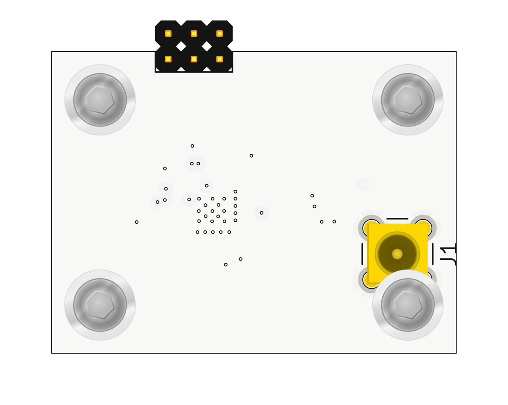
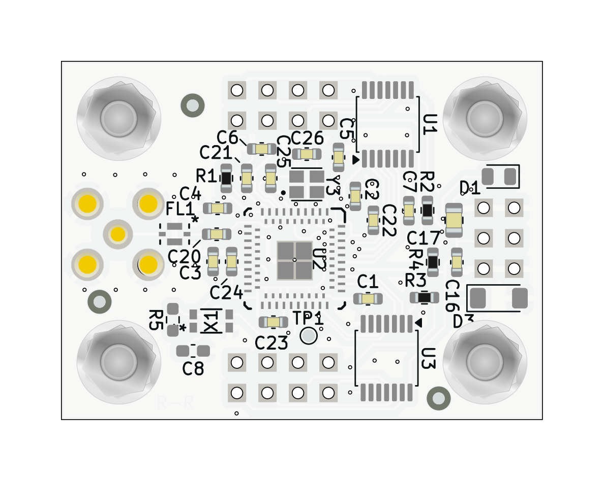

# BLE02 - Dual-Mode Bluetooth HCI Controller

BLE02 is a dual-mode Bluetooth Low Energy controller module based on the CC2564C HCI compatible chipset.  
The module provides UART (HCI) and PCM/I²S digital audio interface and is designed as a compact MLAB building block for integration with external MCU/MPU systems.

The RF section, clocks and power conditioning are implemented on-board. The host processor should handle the Bluetooth stack via HCI transport.

## Key Features

- Dual-mode Bluetooth controller (BR/EDR + LE, Bluetooth 5.1 compliant)
- HCI transport over UART (up to 4 Mbit/s)
- PCM / I²S digital audio interface
- Class 1 transmitter capability (up to +12 dBm)
- Integrated LDO regulator from 3.3V power source
- 26 MHz main crystal oscillator
- 32.768 kHz low-power clock oscillator
- 1.8 V I/O domain (level shifted to 3.3 V on module connectors)
- Single-ended 50 Ω RF interface on MCX connector

The module uses the chip in HCI mode. All higher Bluetooth layers must run on the host MCU.

## Electrical Parameters

### Supply

- **VCC (module input):** 3.3 V nominal
- On-board regulation:
  - CC2564C powered directly from power input
  - I/O domain: 1.8 V (generated internally, exposed as VDD_1V8)
- Typical consumption:
  - TX (GFSK, max power): ~100 mA
  - LE advertising: 200 µA average
  - Shutdown: less than 10 µA

## UART Interface (HCI)

- Transport: H4 (UART)
- Baud rate: 38.4 kbit/s to 4 Mbit/s
- Hardware flow control required (RTS/CTS)

The controller signals boot completion by asserting RTS low after reset.

## Audio Interface (PCM / I²S)

- PCM master or slave mode
- Up to 4.096 MHz bit clock
- Suitable for HFP, A2DP and other audio profiles

Note: Assisted modes (WBS, A2DP assist) cannot be used simultaneously with LE mode.

